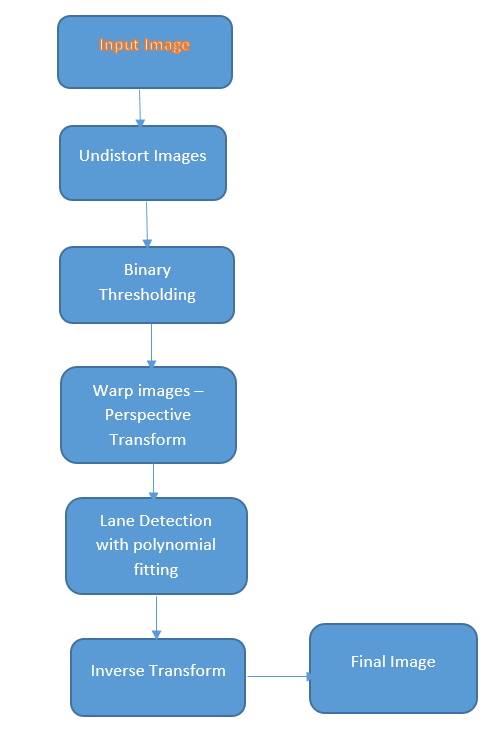

## <b>Udacity Self-Driving Nanodegree 

## Advanced Lane Line Detection
======================================================================

### Detect Lane Lines on test images and project video

All output image files are available in the location output_images and the final project video is project_video_out

> **The Steps in the Project are as following :**

> - Load the camera calibration images provided and get the image and object points
> - Using the camera calibration parameters, undistort the test images as well as video clips.
> - Apply binary thresholding on the undistorted images.
> - Warp the thresholded images using perspective transform to get the birds eye view of the lanes.
> - Fit polynomials into the left and right detected lanes and obtain the radius of curvature.

#### <b>Camera Calibration</b>

Lens typically have distortions and it is necessary to perform distortion correction for the lens before the images from the camera can be further processed.
The camera calibration has been done using openCV functions findChessboardCorners. This function returns the detected corners of the chessboard which serve as our
image points. Object points are obtained by creating a grid of the size of the chessboard images which in this case has 9 rows and 6 columns. As the image and object 
points are found,a matrix is accumulated which essentially is the camera calibration matrix.

Examples of output of the camera calibration image is as follows:

<a>

#### <b>Overall Algorithm</b>

The overall steps can be seen from the flowchart below :  

     

 
#### <b> Undistortion </b>

The undistortion is performed by multiplying the transformation matrix we obtained from the camera calibration.

Sample mages can be seen below:

<a>
Original Distorted Image
</a>
<a>
Undistorted Image
</a>

##### <b>Binary Thresholding</b> 

 The Bianry thresholding is done in two steps. 
 
* First, we do a Sobel thresholding on the image using gradient magnitude thresholding.
* We also do a color thresholding on the HLS image.
  Sample :
  
   
    
* Finally we merge the results of Sobel thresholding and color thresolding to get the binary thresholded image.
  Sample:
  
   

##### <b> Perspective Transform</b> 

Once we have the binary thresholded image, we identify our region of interest and warp the image to get a birds eye view of the image.

     

The code for this portion is available in the method def warp(originalimage, thresholdedimg, idx):

#### <b> Lane Detection </b>

The first step is to do a histogram on the bottom half of the image to find the high intensities i.e. the white pixels on the image. Once we have the histogram, a window of 100 pixels x 100 pixels is used. The bottom image shows the algorithm as it proceeds. For every window the mean of the pixels is computed and then that is used to search the next window in the pixel image.

Once this entire process completes, the algorithm figures out the major chunk of pixels. Once we have the left lane pixels and the right lane pixels a polynomial fitting is performed.

After computing the lanes, we draw them back on the original undistorted image.

<b>Sample output of sliding window search </b>

Once the lanes line region is drawn on the perspective image, the inverse transformation matrix which was obtained when we went from the original image's region of interest to the bird's eye view. This gives the final lane finding image.

The final image overlay and visualization code is also contained in the method def radius_curv(originalimage, binary_warped, inverseM, idx):

 <a href="">Lane-finding</a>
 

#### <b> Finding the radius of curvature </b>

Computing the curvature involves computing the derivatives of the left lane and the right lane.
Since we use a 2nd degree polynomial to fit the lines. The reason for using a 2nd degree polynomial was to fit the curves on the road.

The code for this portion is available in the method def radius_curv(originalimage, binary_warped, inverseM, idx):

### Distance from center

The equation for computing the distance from the center  is as follows.
((B + C) / 2) - A
where
* A - Dot product of the center point (height / 2, width) and TO_METER which is the transformation from pixel space to Meters.
* B - First order of derivative of left lane.
* C - First order of derivative of right lane.

#### <b> Problems with the algorithm </b>

The algorithm seems to do a decent job with the project video but fails on the challenge video but if there is a case where the right lanes appear very close the
left lane , the algorithm fails.
